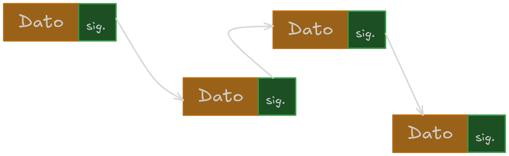

# Listas Enlazadas

Estructura de datos lineal utilizada para almacenar una lista de elementos de cantidad variable.

Una lista se compone de nodos, donde cada nodo guarda un dato (el valor almacenado)  y una referencia para poder acceder al siguiente nodo.

A diferencia de los arrays, las lista enlazadas permiten insertar y eliminar elementos con mas facilidad sin preocuparse por la cantidad elementos.

Diferencia con arrays

| Acciones | Listas Enlazadas | Arrays |
| --- | --- | --- |
| Insertar al final | O(1) si se guarda una referencia al nodo final | O(1) |
| Insertar al principio | O(1) | O(n) porque implica mover todos los elementos  |
| Eliminar elemento | O(1) | O(1) |
| Tamaño flexible | ✅ | ❌ |
| Consumo de memoria | Mayor consumo (requiere de nodos) | Menor consumo (solo guarda el elemento) |
| Acceso a elementos | O(n) | O(1) |

## Otros tipos de listas enlazadas

### Lista enlazada doble

Cada nodo guarda aparte del siguiente nodo, una referencia al nodo anterior. Esto permite recorrer la lista por ambos lados.

### Lista enlazada circular

El siguiente nodo del ultimo nodo apunta al primer nodo

### Lista enlazada circular doble

Lista circular donde el nodo anterior del primer nodo apunta al último y viceversa.

